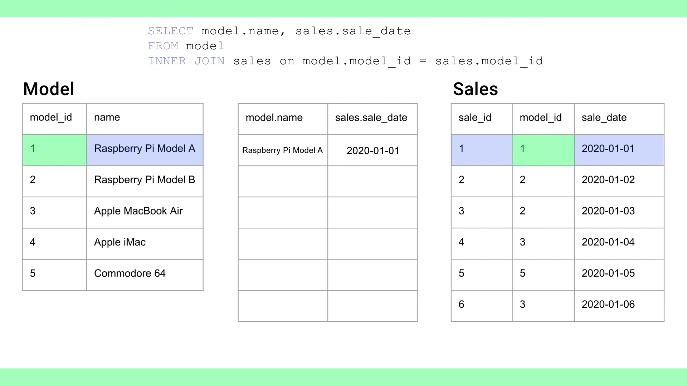
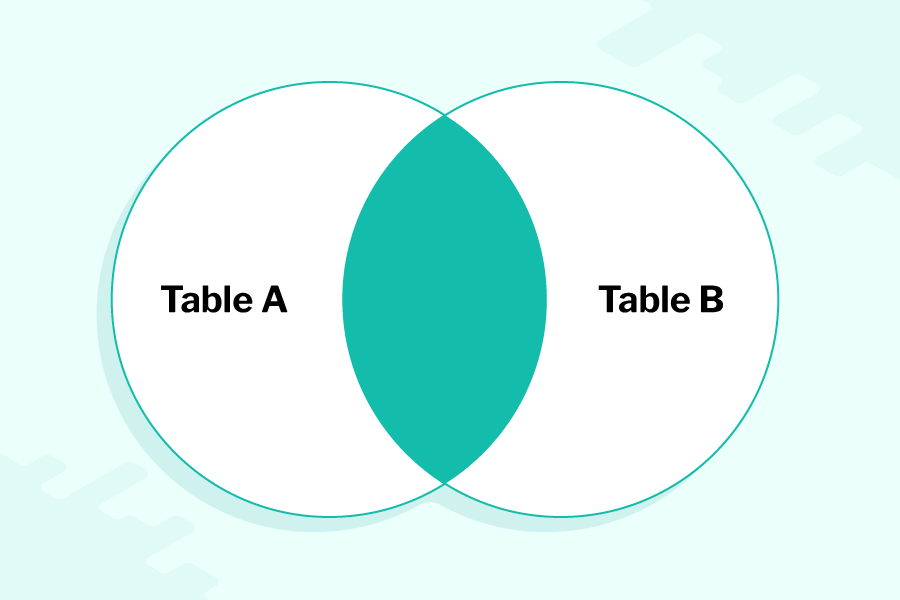
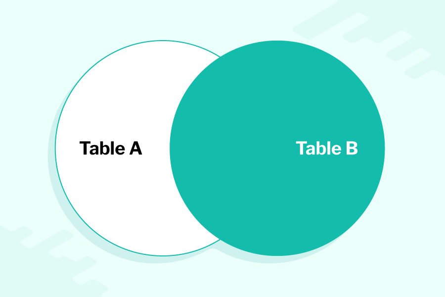

---
tags:
  - Programming_Languages
  - Databases
  - sql
---

## Demonstration database

For the purposes of demonstration we will work from a made up database. This database stores information about computers, their manufacturers, properties and sale data:

* Overall database: **`computer_sales`**
* Tables: `**manufacturer**` , `**model**` , `**sales**`
* Example fields: `**manufacturer_id**` , `**model_id**` , `**name**`, `**year_founded**` , `**ram**` , `**sale_date**`

Below are the `model` and `manufacturer` tables output from the SQLite terminal client.

The model table:

````
model_id    manufacturer_id  name                    cpu_speed   ram         cores       wifi        release_date
----------  ---------------  ----------------------  ----------  ----------  ----------  ----------  ------------
1           1                Raspberry Pi 1 Model A  0.7         256.0       1           0           2013-02-01
2           1                Raspberry Pi 1 Model B  0.7         256.0       1           0           2012-04-01
3           1                Raspberry Pi 1 Model B  0.7         512.0       1           0           2012-10-01
4           1                Raspberry Pi 1 Model A  0.7         512.0       1           0           2014-11-01
5           1                Raspberry Pi 1 Model B  0.7         512.0       1           0           2014-07-01
6           1                Raspberry Pi 2 Model B  0.9         1024.0      4           0           2015-02-01
7           1                Raspberry Pi 3 Model B  1.2         1024.0      4           1           2016-02-01
8           1                Raspberry Pi 3 Model B  1.4         1024.0      4           1           2018-03-14
9           1                Raspberry Pi 3 Model A  1.4         1024.0      4           1           2018-11-01
10          1                Raspberry Pi 4 Model B  1.5         1024.0      4           1           2019-06-24
11          1                Raspberry Pi 4 Model B  1.5         2048.0      4           1           2019-06-24
12          1                Raspberry Pi 4 Model B  1.5         4096.0      4           1           2019-06-24
13          1                Raspberry Pi Zero       1.0         512.0       1           0           2015-11-01
14          1                Raspberry Pi Zero W     1.0         512.0       1           1           2017-02-28
15          2                Apple Lisa              0.008       1.0         1           0           1983-01-19
16          2                Apple iMac              3.7         8192.0      4           1           2019-03-19
17          2                Apple MacBook Pro       2.6         16384.0     6           1           2019-05-21
18          2                Apple MacBook Air       2.6         8192.0      2           1           2019-07-09
19          3                Commodore VIC-20        0.00102     0.005       1           0           1980-01-01
20          3                Commodore 64            0.001023    0.064       1           0           1982-08-01
21          3                Amiga 500               0.00716     0.5         1           0           1987-04-01
````

The manufacturer table: 

````
manufacturer_id  name          url                      year_founded  trading
---------------  ------------  -----------------------  ------------  ----------
1                Raspberry Pi  <https://raspberrypi.org>  2008          1
2                Apple         <https://apple.com>        1976          1
3                Commodore     <https://www.commodore.c>  1954          0
````

## Main commands

There are obviously many SQL commands but most standard CRUD actions can be executed with a small number of commands:

* `SELECT`
* `UPDATE`
* `CREATE`
* `INSERT`
* `DELETE`

## Language structure

Before we start using the syntax we need to understand the grammar:


Expressions differ from clauses and predicates in that they are not the mechanism for returning data (i.e. declaring a clause and a logical condition) they do something to the data, as part of the retrieval. This is a bit subtle: 

* \`SELECT name FROM model WHERE cores = "4" 
  * This retrieves the models that have 4 cores 
* \`SELECT count(\*) FROM model WHERE cores = "4" 
  * This counts the number of models that are returned where the counting is a function over and above the retrieval itself.

### Examples from `computer_sales.db`

`sqlite> SELECT * from model WHERE cpu_speed=0.7` : return all models with a CPU speed equal to 0.7:

````
model_id    manufacturer_id  name                    cpu_speed   ram         cores       wifi        release_date
----------  ---------------  ----------------------  ----------  ----------  ----------  ----------  ------------
1           1                Raspberry Pi 1 Model A  0.7         256.0       1           0           2013-02-01
2           1                Raspberry Pi 1 Model B  0.7         256.0       1           0           2012-04-01
3           1                Raspberry Pi 1 Model B  0.7         512.0       1           0           2012-10-01
4           1                Raspberry Pi 1 Model A  0.7         512.0       1           0           2014-11-01
5           1                Raspberry Pi 1 Model B  0.7         512.0       1           0           2014-07-01
````

````
count(*)
----------
5
````

 > 
 > Any value that is not a number should be in single-quotes, never double quotes

## The `WHERE` clause

Within the `SELECT` statement, the `WHERE` clause specifies the search criterion. The `WHERE` clause should always be last in the syntax. The clauses are always written in this order: `FROM` followed by `WHERE`.

`SELECT name, cores, release_date FROM model WHERE CORES="4";`:

````
name                    cores       release_date
----------------------  ----------  ------------
Raspberry Pi 2 Model B  4           2015-02-01
Raspberry Pi 3 Model B  4           2016-02-01
Raspberry Pi 3 Model B  4           2018-03-14
Raspberry Pi 3 Model A  4           2018-11-01
Raspberry Pi 4 Model B  4           2019-06-24
Raspberry Pi 4 Model B  4           2019-06-24
Raspberry Pi 4 Model B  4           2019-06-24
Apple iMac              4           2019-03-19
````

## Compound statements

Compound statements allow you to apply more filters to your clauses within an SQL statement. SQL allows you to build complex, combinatorial `WHERE` clauses by using Boolean and mathematical operators (i.e `AND` , `OR` , `>` , `<` , `!=` , `<=` ...)

Multiple clauses: 

````sql
SELECT name, ram, release_date
FROM model
WHERE release_date > '2018-01-01' AND ram > 512;
````

More complex logic achieve with parentheses:

````sql
SELECT name, cores, release_date
FROM model
WHERE (manufacturer_id = 1 OR manufacturer_id = 2) AND cores >= 2;
````

### Wildcards

SQL does not use Regex. Instead it has a simpler glob-like syntax for carrying out string matching.

In order to signal that you wish to compare by a wildcard and not a value, you have to use the `LIKE` keyword. The actual wildcard operator is `%` .

In an SQL statement, the `%` wild card will match any number of occurrences of any character. 
Any characters can appear before or after ‘MacBook’ and the record will still be returned:

````sql
SELECT name, cores, release_date
FROM model
WHERE name LIKE '%MacBook%';
````

This wildcard only filters characters that come after `Raspberry` :

````sql
SELECT name, cores, release_date
FROM model
WHERE name LIKE 'Raspberry%';
````

## Retrieving data queries (`SELECT`)

### **Print/retrieve/write an entire table, unfiltered**

````sql
SELECT * FROM [table_name]

SELECT * FROM model
````

### Retrieve all data from a specific field

````sql
SELECT [field_name] FROM [table_name]

SELECT name FROM manufacturer
````

### Retrieve data and order it

This example orders alphabetically: 

````sql
SELECT [field_name] FROM [table_name] ORDER BY [property]
SELECT name FROM model ORDER BY name 
````

 > 
 > When `ORDER BY` is used the default method for strings is alphabetical and for integers it is ascending order.

Here's a more complex real-life request:

````sql
SELECT name, cores, ram FROM model ORDER BY ram, name
````

It gives us:

````
name              cores       ram
----------------  ----------  ----------
Commodore VIC-20  1           0.005
Commodore 64      1           0.064
Amiga 500         1           0.5
Apple Lisa        1           1.0
Raspberry Pi 1 M  1           256.0
Raspberry Pi 1 M  1           256.0
Raspberry Pi 1 M  1           512.0
Raspberry Pi 1 M  1           512.0
Raspberry Pi 1 M  1           512.0
Raspberry Pi Zer  1           512.0
````

But we can obviously specify our own ordering method:

````sql
SELECT name, cores, release_date FROM model ORDER BY cores DESC, name;
````

Returns:

````
name               cores       release_date
-----------------  ----------  ------------
Apple MacBook Pro  6           2019-05-21
Apple iMac         4           2019-03-19
Raspberry Pi 2 Mo  4           2015-02-01
Raspberry Pi 3 Mo  4           2018-11-01
Raspberry Pi 3 Mo  4           2016-02-01
Raspberry Pi 3 Mo  4           2018-03-14
Raspberry Pi 4 Mo  4           2019-06-24
Raspberry Pi 4 Mo  4           2019-06-24
Raspberry Pi 4 Mo  4           2019-06-24
````

 > 
 > `ORDER BY` always comes last, after the selection and any filtering clauses but *before* a `WHERE` clause

## Inserting data (`INSERT`)

### Adding a record

````sql
INSERT INTO sales
VALUES (1, 11, '2020-01-01','mhogan');
````

If you intend to miss out a value, you shouldn't leave it blank, you should instead use `NULL` :

````sql
INSERT INTO sales
VALUES (1, 11, '2020-01-01', NULL);
````

 > 
 > There is a problem with this format: it only works so long as the order to the values in the `VALUES` clause corresponds to the order of the fields in the tables. To rule out error we should instead specify these fields along with the table name:

````sql
INSERT INTO sales**(employee_id, sale_id, model_id, sale_date)**
VALUES ('mhogan', 1, 11, '2020-01-01',);
````

## Modifying existing records (`UPDATE`)

### Schematic syntax

````sql
UPDATE [table_name]
SET [field]
WHERE [conditional expression/filter]
````

### Real example

````sql
UPDATE manufacturer
SET url = '<http://www.hp.co.uk>'
WHERE manufacturer_id = 4; // typically this will be the primary key as you are updating and existing record and need to identify it uniquely
````

### Multiple fields

````sql
UPDATE manufacturer
SET url = '<http://www.apple.co.uk>',
    year_founded = 1977
WHERE manufacturer_id = 2;
````

## Deleting records (`DELETE`)

````sql
DELETE FROM sales WHERE sale_id = 1;
````

## Change table structure (`ALTER`)

We use the `ALTER` query to add, remove and otherwise change the structural properties of a table.

### Add an additional field to existing table (`ALTER`)

This adds a `price` field to the `sales` table. The `price` field accepts data of the type `real` . `real` is a slightly less precise (less memory) version of float

````sql
ALTER TABLE sales ADD price real;
````

## Create a table (`CREATE`)

````sql
CREATE TABLE employee (
    employee_id text PRIMARY KEY,
    first_name text,
    surname text,
    address_number integer,
    address_1 text,
    address_2 text,
    locality text,
    region text,
    postal_code text,
    phone_number text,
    days_per_week real
    );
````

We specify the new table name first, then it's fields and their corresponding data types. We also set a primary key

## Creating relationships between tables with `PRIMARY` and `FOREIGN` keys

We will demonstrate with an example. We already have the `sales` table. We want to create new table called `returns` that will sustain a one-to-one relationship with `sales`. We are going to use the `sale_id` as our foreign key in `returns`. This is the primary key in `sales`.

The `sales` table:

````
sale_id     model_id    sale_date   employee_id  price
----------  ----------  ----------  -----------  ----------
1           44          2020-07-27  tbishop      399.99
2           22          2021-02-07  tbishop      200.99
````

Creating the `returns` table and establishing relationship with `sales` using the `FOREIGN KEY`  keyword:

````sql
CREATE TABLE returns (
	return_id integer PRIMARY KEY,
	sale_id integer NOT NULL,
	date_returned text,
	reason text,
	FOREIGN KEY (sale_id) REFERENCES sales(sale_id)
	);
````

Here's an example with more than one foreign key:

````sql
CREATE TABLE returns (
    return_id integer PRIMARY KEY,
    sale_id integer NOT NULL,
    employee_id text NOT NULL,
    date_returned text,
    reason text,
    FOREIGN KEY(sale_id) REFERENCES sales(sale_id),
    FOREIGN KEY(employee_id) REFERENCES employee(employee_id)
    );
````

## Selecting and combining data from multiple tables

---

Once a relationship has been created using primary and foreign keys (as detailed in the previous section), you are able to combine and integrated data from the different tables. This is known as performing **joins.**

### Inner joins

We can demonstrate this with the following scenario:

 > 
 > We want to create a list of the name of all computers that have been sold and when they were sold.

This will require us to use the `name` field from the `model` table and the `sale_date` field from the `sales` table.

Here's the SQL:

````sql
SELECT model.name, sales.sale_date
FROM model
INNER JOIN sales on model.model_id = sales.model_id;
````

* We use dot notation to distinguish the `table.field` for each table.
* We use `INNER JOIN` to join the `sales` table with the `model` table where `model_id` field in `model` is the same as the `model_id` field in `sales`

This returns:

````sql
name                     sale_date  
--------------------     ----------  
Raspberry Pi 2 Mo  4     2015-02-01
Raspberry Pi 3 Mo  4     2018-11-01
````

Note data will only be returned when there is a match between both fields stated in the `SELECT` clause. There must be corresponding data between `model.name` and `sale.sale_data` for a row to be returned. For example if there is a model that has not been sold, there will be a `mode.model_name` but no `sale_data` .



### Outer joins

In the example above, we used the `INNER JOIN` method. This enshrines the logic:

 > 
 > return only rows where there is a matching row in both tables

Which in the applied context means:

* If there is a model that has never been sold, it won’t be returned
* If there is a sale without a model, it won’t be returned

But there are other types of join that satisfy other types of logic.

The logical state that obtains in the case of **inner joins**:



The logical state that obtains in the case of **left outer joins**


The logical state that obtains in the case of **right outer joins**:


The logical state that obtains in the case of **full outer joins**:


This type of join is used when you want to discern when there is *not* a match between two fields across tables. For example: imagine that you wanted a list of computers that had never been sold. In this case, you would be interested in rows where there is a `model_id` without a corresponding `sales_id` .

In SQL this would be achieved with:

````sql
SELECT model.name, sales.sale_date
FROM model
LEFT JOIN sales on model.model_id = sales.model_id;
````

Note that this would return all the model names but where there isn't a sale data, `NULL` would be returned. This is an **important distinction :** the outer join method doesn't just return the rows with a `NULL` value for `sale_date` as we might expect. It returns all models along with those that have not been sold. This is because it is oriented to the "left" table, equivalent to the table in the SQL that we cited first with the `on` keyword.

 > 
 > A left outer join returns all the records from the left (model) table and those that match in the right (sales) table. Where there are no matching records in the right (sales) table, a `NULL` value is returned.

A **right outer join**, often referred to as a right join, is the opposite of a left outer; it returns all the records from the right table and those that match in the left table. In our scenario this would be all the models that had a `sale_date` including models that didn't have a `sale_date` , i.e which returned `NULL`

Finally, a **full outer join** returns all the records from both tables, and where a record cannot be matched, a NULL value is returned. So this would mean there could be `NULL`s in both fields of the returned rows.

We can combine multiple types of join in the same SQL query:

````sql
SELECT model.name, sales.sale_date, manufacturer.url
FROM model
LEFT JOIN sales on model.model_id = sales.model_id
INNER JOIN manufacturer on model.manufacturer_id = manufacturer.manufacturer_id;
````

## Aggregate functions

Count return with custom variable: 

````sql
SELECT COUNT(*) AS total_sales
FROM SALES
````

Sum: 

````sql
SELECT SUM(price) as total_value
FROM sales
````

Average: 

````sql
SELECT AVG(price) as average_income
FROM sales
````

Applying aggregate function with sorting applied:

````sql
SELECT COUNT(*) AS total_sales
FROM sales
GROUP BY employee_id
````
