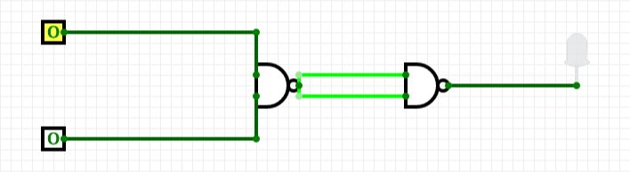
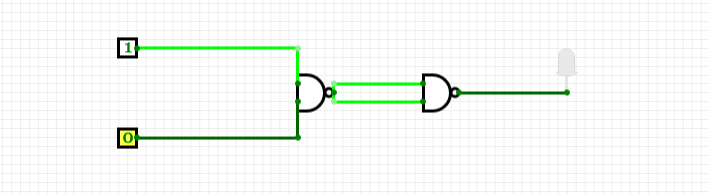
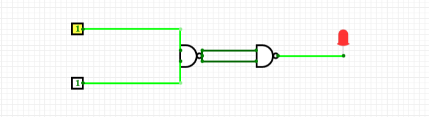

---
categories:
  - Computer Architecture
  - Electronics
  - Hardware
tags: [logic-gates]
---

# AND gate

Just as we can create `NOT` logic from a NAND gate, without the `AND` conditions, we can create a circuit that exemplifies the truth conditions of `AND` just by discluding those of those of `NOT`.

When we attach two NAND gates in sequence connected to two switches as input this creates the following binary conditions:

```
A    B   Output
_    _   _____

1    1     1       (1)
1    0     0       (2)
0    1     0       (3)
0    0     0       (4)
```

Which is identical to the truth table for `AND` :

```
p    q   p & q
_    _   _____

t    t     t      (1)
t    f     f      (2)
f    t     f      (3)
f    f     f      (4)
```

**An AND at 0 0 :**



**AND at 1 0 or 0 1 :**


**AND at 1 1**

