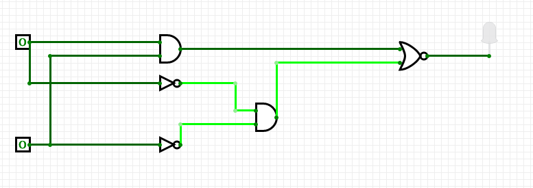
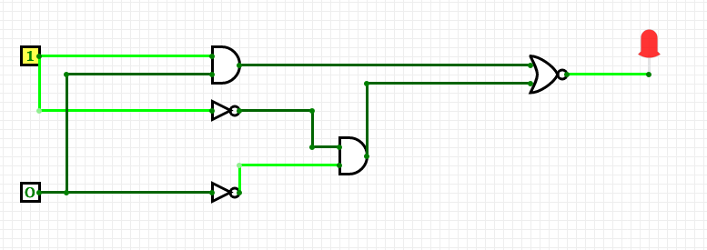
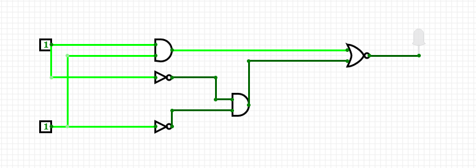
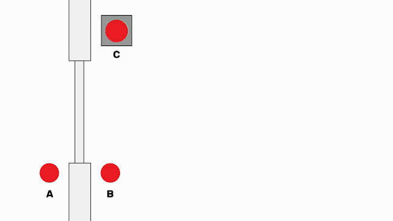
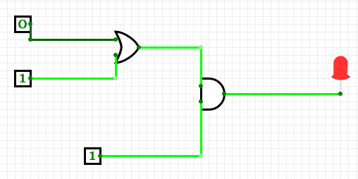

---
categories:
  - Computer_Architecture
  - Electronics
  - Hardware
tags: [logic-gates, binary]
---

# Logic circuits

 > Now that we are familiar with the individual [logic gates](Logic_gates.md) and their truth conditions we are in a position to create **logic circuits**. These are combinations of logic gates controlled by inputs that can provide a range of useful outputs. The output of a logic gate is a function of the truth-values of the individual gates and their connections to each other.

## Basic example

In the below circuit we have the following gates connected to two inputs with one output, moving through the following stages:

1. `AND`, `NOT`, `NOT`
1. `AND`, `NOR`

This is equivalent to the following truth table:

````
A    B   Output
_    _   _____

0    0     0       (1)
1    0     1       (2)
0    1     1       (3)
1    1     0       (4)
````



*Line 1 of the truth table*




*Line 2 and 3 of the truth table (equivalent to each other)*




*Line 4 of the truth table*

## Applied example

With this circuit we have a more interesting applied example.

It corresponds to an automatic sliding door and has the following states

* a proximity sensor that opens the doors when someone approached from outside
* a proximity sensor that opens the doors when someone approaches from the inside
* a manual override that locks both approaches (inside and out) meaning no one can enter of leave

Here's a visual representation:



The following truth table represents this behaviour, with A and B as the door states, C as the override and X as the door action (0 = open, 1 = closed)

````
A  B  C  X
_  _  _  _

0  0  0  0      
1  0  0  0     
0  1  0  0     
1  1  0  0
0  0  1  0
1  0  1  1
0  1  1  1
1  1  1  1
````



*Automatic door sensor with manual override*
