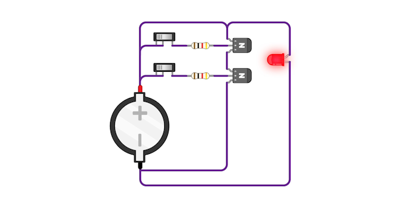
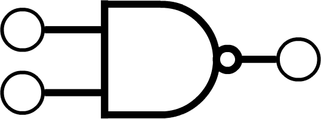

---
categories:
  - Computer Architecture
  - Electronics
  - Hardware
tags: [logic-gates, binary]
---

# NAND gate

A NAND gate is a logic gate that inverts the truth-conditions for `AND`.

A real-life circuit showing two switches corresponding to two transistors which control the LED light: 



In this circuit, there are two transistors, each connected to a switch. The switches control the LED light. So the switches are the input and the LED is the output.

For clarity, we are not going to draw both transistors, we will simplify the diagram with a symbol for them which stands for the NAND gate:




The diagram below shows how the circuit models the truth conditions for `NAND`

Diagram representing NAND gate:


* When both switches are off (corresponding to `false` `false`) the output is on (the bulb lights up).
* If either one of the switches are on, the output remains on (corresponding to `true` `false` or `false` `true` )
* It is only when both switches are on, that the output is off (corresponding to `true` `true` )


This is the exact opposite to the truth-conditions for AND.

## Transliterating the logic truth-table to the switch behaviour

We can now present a truth table for NAND along side that for AND: 

```
A    B   Output
_    _   _____

f    f     t      
t    f     t      
f    t     t       
t    t     f       

A    B   Output
_    _   _____
t    t     t
t    f     f
f    t     f
f    f     f
```
We can see that it inverts the value of AND.

## Significance of the NAND gate: functional completeness

> **Equipped with just a NAND we can represent every other possible logical condition within a circuit.**

In practice, it is more efficient to use specific dedicated gates (i.e OR, AND, NOT etc) for the other Boolean connectives but in principle the same output can be achieved through NANDs alone.  

When we add more NAND gates and combine them with each other in different ways we can create more complex output sequences and these too will have corresponding truth tables.
