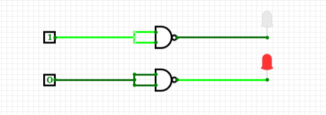
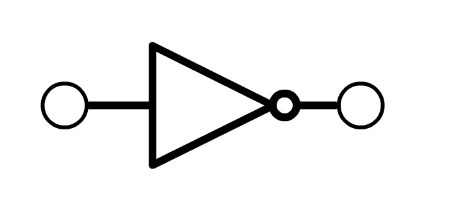

---
tags:
  - Logic
  - Electronics
  - Hardware
  - logic-gates
---
# NOT gate

This gate corresponds to the negation logical connective.

Negation switches the value of a proposition from `true` to `false`. When we put `~` before `true` it becomes `false` and when we put `~` before `false` it becomes `true` .

The truth-table for negation:
````
P			~P
T			F	
F			T
````
In terms of gates this logic obviously corresponds to a simple on/off switch. 

In terms of pure logic, negation is an unary connective in contrast to binary connectives like conjuction and disjunction. It doesn't operate on two parts it simply switches the truth value of whichever proposition it is applied to. 

How then, can it be expressed in terms of a gate that takes two inputs and returns an output? Well, we can recreate the logic by manipulating a NAND gate. (Demonstrating the point that many logical conditions are expressible purely via NAND gates.)

Although a NAND can take a total of two inputs, it would be controlled by a single switch, such that both inputs would be set to `1 1` or `0 0` when the switch is activated and deactivated. This would remove the `AND` aspect of `NAND` and reduce it to `NOT` .

A NAND gate simulating NOT logic



Going back to the truth-conditions for NAND, NAND-as-NOT just means that the conditons on lines 1 and 4 obtain:

```
A    B     C
_    _     _

0    0     1      1    
1    0     1      2 
0    1     1      3 
1    1     0      4
```

### Symbol for `NOT` gate

NOT has its own electrical symbol to distinguish it from a NAND:



Note that as this is an abstraction of the process, there is no need to show two inputs in the representation of the gate. We have a single input and single output reflecting the unary nature of the negation operator. 