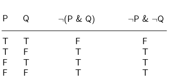
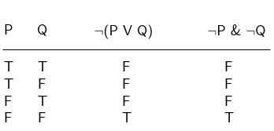

---
categories:
  - Logic 
tags: [propositional-logic]
---

DeMorgan's laws express some fundamental equivalences that obtain between the Boolean [connectives](Truth-functional%20connectives.md):

## First Law

> The negation of a conjunction is logically equivalent to the disjunction of the negations of the original conjuncts.

$$
\sim (P \& Q) \equiv \sim P \lor \sim Q
$$

The equivalence is demonstrated with the following truth-table

## Second Law

> The negation of a disjunction is equivalent to the conjunction of the negation of the original disjuncts.

$$
\sim (P \lor Q) \equiv \sim P & \sim Q
$$

