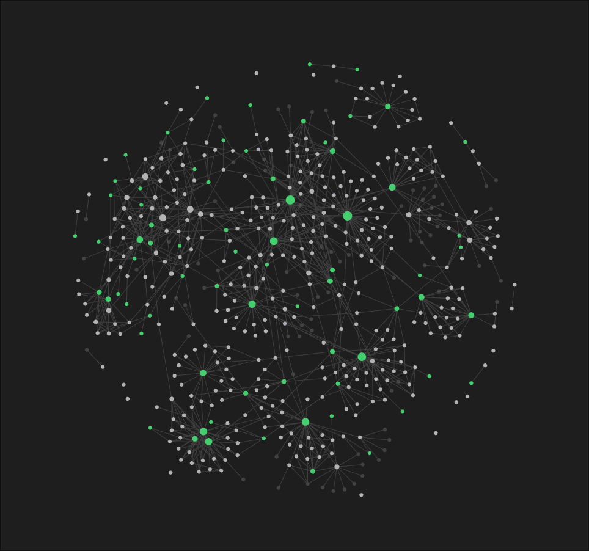

# Eòlas

 

> Eólas is Irish for knowledge or information, especially knowledge gained by
> experience or practice

This repository is my technical knowledge management system or "second-brain".
It comprises notes from my autodidactic study of software engineering and
computer science.

## Implementation

It is a [Zettelkasten](https://en.wikipedia.org/wiki/Zettelkasten) work in
progress. I've recently converted the topic-based subdirectories into a single
flat directory structure organised by tags. I'm in the process of partitioning
longer notes into smaller units.

I use the [zk](https://github.com/zk-org/zk) CLI package to help with indexing
and task automation alongside its [zk-nvim](https://github.com/zk-org/zk-nvim)
Neovim wrapper. I occassionally utilise [Obsidian](https://obsidian.md/)
alongside Neovim for when I want to view my notes as a knowledge graph or read
them alongside their rich content (images, videos etc).

## Scripts

The [scripts](/scripts) directory contains several Bash and Python scripts I use
for general housekeeping, such as formatting image URLs, removing unused assets,
and autosaving.
