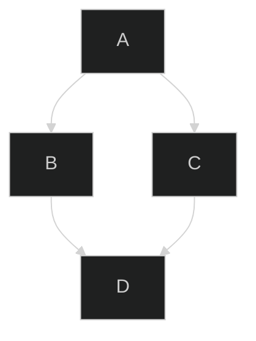
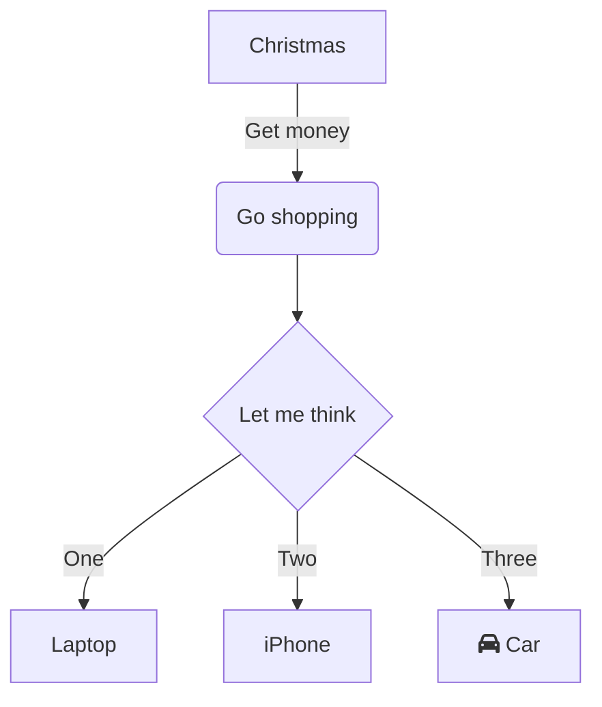
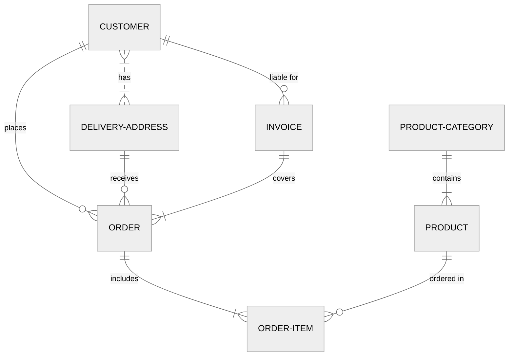
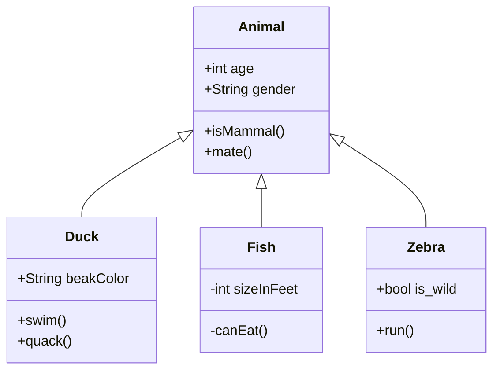

```mermaid

%%{init: {'theme':'dark'}}%%
  graph TD;
      A-->B;
      A-->C;
      B-->D;
      C-->D;
```

```mermaid
%%{init: {'theme':'default'}}%%
flowchart TD
    A[Christmas] -->|Get money| B(Go shopping)
    B --> C{Let me think}
    C -->|One| D[Laptop]
    C -->|Two| E[iPhone]
    C -->|Three| F[fa:fa-car Car]
```

```mermaid
%%{init: {'theme':'neutral'}}%%
erDiagram
    CUSTOMER }|..|{ DELIVERY-ADDRESS : has
    CUSTOMER ||--o{ ORDER : places
    CUSTOMER ||--o{ INVOICE : "liable for"
    DELIVERY-ADDRESS ||--o{ ORDER : receives
    INVOICE ||--|{ ORDER : covers
    ORDER ||--|{ ORDER-ITEM : includes
    PRODUCT-CATEGORY ||--|{ PRODUCT : contains
    PRODUCT ||--o{ ORDER-ITEM : "ordered in"
```

```mermaid
%%{init: {'theme':'default'}}%%
classDiagram
    Animal <|-- Duck
    Animal <|-- Fish
    Animal <|-- Zebra
    Animal : +int age
    Animal : +String gender
    Animal: +isMammal()
    Animal: +mate()
    class Duck{
      +String beakColor
      +swim()
      +quack()
    }
    class Fish{
      -int sizeInFeet
      -canEat()
    }
    class Zebra{
      +bool is_wild
      +run()
    }
```
