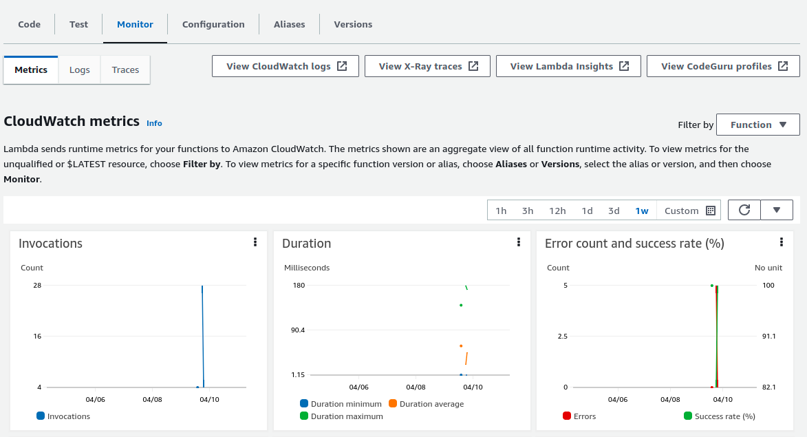
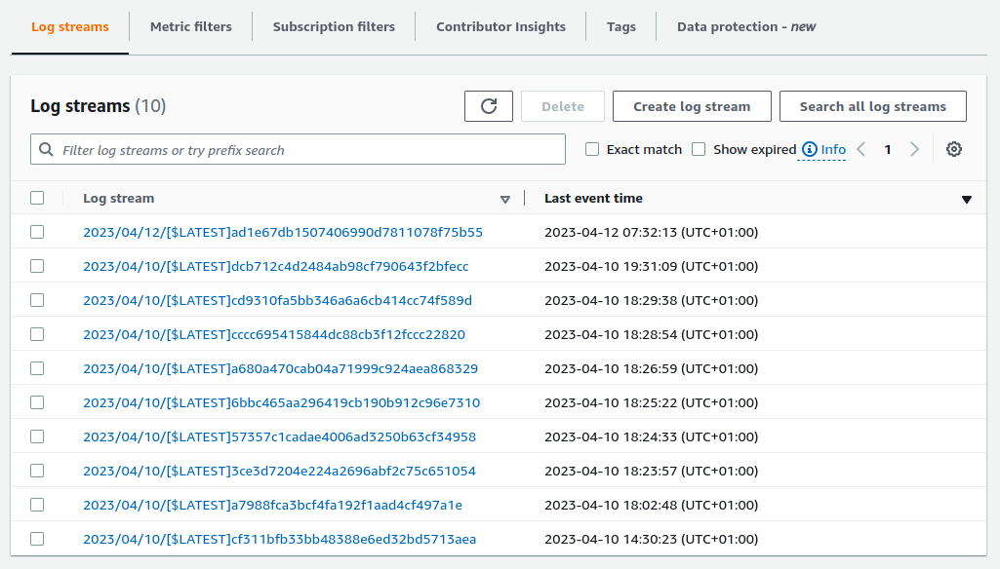

# AWS CloudWatch

AWS CloudWatch is a monitoring and observability service offered by Amazon Web
Services (AWS). It is designed to help users collect, track, and analyze various
metrics, logs, and events related to their AWS resources and applications
running on the AWS cloud. CloudWatch enables users to gain operational insights
and take timely actions to maintain the performance, availability, and health of
their infrastructure and applications.

## Key features

- Metrics
  - CloudWatch collects and stores metrics from various AWS services, such as
    EC2 instances, Lambda functions, and RDS databases. Users can monitor these
    metrics in real-time, set alarms based on thresholds, and visualize them
    through customizable dashboards.
- Logs
  - CloudWatch Logs enables users to collect, store, and analyze log data from
    AWS resources and applications.
- Events
  - Events allows users to respond to changes in their AWS resources
    automatically by triggering actions such as sending notifications, invoking
    Lambda functions, or starting/stopping EC2 instances.
- Alarms
  - Users can set alarms based on specified metric thresholds. When an alarm is
    triggered, CloudWatch can send notifications or automatically take
    corrective actions.
- Dashboards
  - Dashboards provide customizable, at-a-glance visualizations of various
    metrics and logs, making it easier to monitor the health and performance of
    AWS resources and applications.

## Accessing CloudWatch

CloudWatch can usually be accessed directly from within the dashboard for the
given AWS service under the "Monitor" tab. For example with AWS Lambda:

In addition to graphical metrics, we can also view specific logs for each event
and execution of the given service. In the case of a Lambda function:

