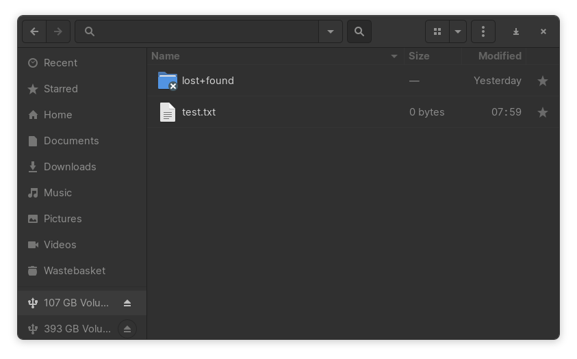

---
tags:
  - disks
  - computer-architecture
  - operating-systems
---

# Filesystems

We cannot yet mount or interact with the partitions we have created. This is
because we have not added a filesystem to each partition.

> A filesytem is a form of [database](Basic_database_concepts.md); it
> supplies the structure to transform a simple block device into the
> sophisticated hierarchy of files and subdirectories that users can understand.

Linux recognises many types of filesystems. The native Linux filesystem is the
**ext4** (Fourth Extended Filesystem). Another common filesystem is **FAT**
(File Allocation Table). Instances of this include _MSDOS_,_EXFAT_,_FAT-32_.
They originate from Microsoft systems

## Creating a filesystem

Remember we have two partitions on our external drive: `sda1` and `sda2`. We are
going to use the `mkfs` utility to create an EXT4 system on both.

```bash
mkfs -t ext4 /dev/sda1
mkfs -t ext4 /dev/sda2
```

## Mounting a filesystem

We can now mount our filesystems. When we mount, we must specify the following
criteria with the request:

- The name of the device we want to mount.
  - This will be the name or the partition. However the names (`sda` etc)
    assigned by the OS can change. In these cases and with GPT-based partitions
    you can use the UUID.
  - To see a list of devices and the corresponding filesystems and UUIDs on your
    system, you can use the **`blkid`** ('block id') program.
    ```
    /dev/nvme0n1p3: UUID="c53577b5-92ef-4a0a-9a19-e488bfdfa39c" BLOCK_SIZE="4096" TYPE="ext4" PARTUUID="e152b9f4-7ce8-e74b-94db-2731c6fce53d"
    /dev/nvme0n1p1: UUID="9920-636A" BLOCK_SIZE="512" TYPE="vfat" PARTUUID="50592521-d386-194a-a362-bc8562ed6c82"
    /dev/nvme0n1p2: UUID="2ee6b834-0857-49dc-b8ba-a24d46d228ae" BLOCK_SIZE="4096" TYPE="ext4" PARTUUID="e08cc442-ef51-7b4f-9d55-e236c55c933c"
    /dev/sda2: UUID="abac6e2e-e3bf-40d3-a5ba-317c53eb27ce" BLOCK_SIZE="4096" TYPE="ext4" PARTUUID="4ef1b0e8-3d5b-c940-a3b1-0f85cddeca42"
    /dev/sda1: UUID="ba1e40c5-9b29-4309-a559-99bf8f68116f" BLOCK_SIZE="4096" TYPE="ext4" PARTUUID="b4983358-6036-df40-a1f8-793976f3dfb1"
    ```
- The filesystem type (optional)
- The **mount point**
  - This is the place within the existing filesystem where you want to mount the
    partition.
  - When you mount to a directory, this directory _becomes_ the disk you have
    mounted, you will not see it as a subdirectory within the the mount point,
    you will just see the contents of the disk itself

```bash
mkdir mountpoint
mount -t ext4 /dev/sda1 /mnt
touch test.txt
```

Our `sda1` partition is now mounted at `mountpoint`. We can go ahead and create
files. If we now look within the graphical file manager when we click on the
`sda1` volume, we will see the new file we have created in `mountpoint`.



## fstab

In most cases you want your filesystem to mount automatically on boot and always
to the same mount point. You can do this via the specialised `fstab` file on
Linux systems within the `/etc/` directory.

This is my current `fstab`:

```
# <file system> <dir> <type> <options> <dump> <pass>
# /dev/nvme0n1p2
UUID=2ee6b834-0857-49dc-b8ba-a24d46d228ae	/         	ext4      	rw,relatime	0 1

# /dev/nvme0n1p3
UUID=c53577b5-92ef-4a0a-9a19-e488bfdfa39c	/home     	ext4      	rw,relatime	0 2

/swapfile none swap sw 0 0

```

It shows my root and home filesystems and my
[swap](Swap_space.md) file. Note that we use the UUID
to name the partition rather than its name in `/dev/`. The order of the
parameters is as follows:

- Device name or UUID
- The mount point
- The filesystem type (in the example there are two types (`ext4` and `swap`))
- Options
- Now largely irrelevant backup information, set to )
- Filesystem integrity test order
  - Runs the `fsck` ('filesystem check') command against each filesystem
  - Put `1` against the root partition for this to be checked first
  - Put `0` for no checks to take place
