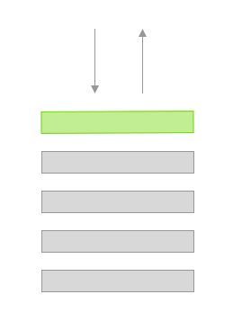
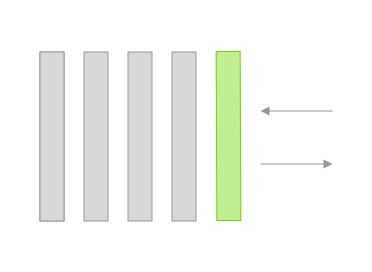

---
tags:
  - data-structures
---

_A stack visualised vertically_ 

_A stack visualised horizontally_ 

## A stack is a linear data structure that observes LIFO

Think of a stack like a pile of books: the last book that you add is the nearest
to the top and therefore the first one that you can remove.

If you want to get a book that is not at the top, you have to first remove the
books that are above it to get to it.

This type of data structure is linear and only allows sequential, not random,
access. It is an example of 'last one in first one out'.

## We can build a stack from an array

A stack is an example of a data structure that can be built by adapting an
array. If you think about it, all that is needed is an array to store the data,
an `array push` method to add elements to the 'end' or the 'bottom' of the stack
and an `array pop` method to remove the element at the top.

## Demonstration

Below we create a stack constructor, using a class. An object created from this
template will have the following properties and methods:

- `items[]` → an array to store the data
- `push()` → a method to add an element to the end of the stack
- `pop()` → a method to remove an element from the front

In addition we have the following helpers, which allow us to check the status of
the stack and retrieve information about it:

- `isEmpty()` → check if the stack is populated or not
- `clear()` → empty the stack of its content (therefore making `isEmpty()`
  return `true`)
- `size` → a property corresponding to the stack's length

```js
class Stack {
  items = []; // the array that will store the elements that comprise the stack
  push = (element) => this.items.push(element); // add an element to the end of the stack
  pop = () => this.items.pop(); // remove and return the last element from the stack

  // We can add some useful helper methods, that return info about the state of the stack:
  isEmpty = () => this.items.length === 0; // return true if the stack is empty
  clear = () => (this.items.length = 0); // empty the stack
  size = () => this.items.length; // count elements in stack
}
```

## Run through

```js
let stack = new Stack();
test.push(1); // Add some elements to the stack
test.push(2);
test.push(3);

// Stack now looks like:
console.log(stack.items); // [1, 2, 3]

// Let's try removing the last element
stack.pop(); // 3 -> this was the last element we added, so it's the first one that comes out

// Now the stack looks like this:
// [1,2]

// Let's add a new element
test.push(true);

// Now the stack looks like:
// [1,2, true]
```

## Practical applications

- Any application that wants to got 'back in time' must utilise a stack. For
  example, the 'undo' function in most software is a function of a stack. The
  most recent action is at the top, and under that is the second most recent and
  so on all the way back to the first action.
- Recursive functions: a function that calls itself repeatedly until a boundary
  condition is met is using a stack structure. As you drill down through the
  function calls you start from the most recent down to the last.
- Balancing parentheses. Say you want to check if the following string is
  balanced `[()]` . Every time you find an opening parentheses. You push that to
  the front of a stack. You then compare the closing parentheses with the order
  of the stack. The same could be done when seeking to find palindromes. This
  sort of thing could be a code challenge so build an example.
