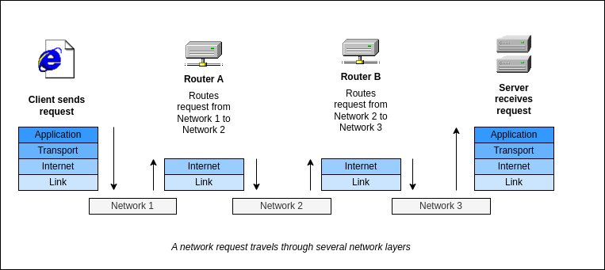
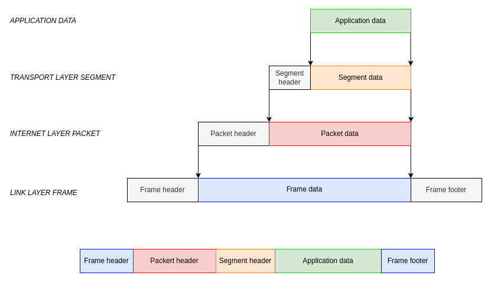

# Example scenario of data transfer accross the internet

- A client device is connected to a wireless WiFi network.
- This network is connected to the internet via a router.
- Elsewhere on the internet is a server also connected to the internet via
  router.
- A user of the client device opens a web browser and requests a web page hosted
  on the server (we will assume it already knows the IP address)
- The web browser knows HTTP - a protocol of the
  [Application Layer](Application_Layer_of_Internet_Protocol.md) - and forms an
  HTTP request intended for the destination server.
- The browser hands off the HTTP request to the TCP/IP software stack of the
  device's [operating system](Basic_model_of_the_operating_system.md), asking
  that the data be delivered to the server on its IP address and at port 80.
- The TCP/IP software stack on the client OS encapsulates the HTTP payload in a
  TCP segment (at the
  [Transport Layer](Transport_Layer_of_Internet_Protocol.md)), setting the
  destination port to 80 in the segment header.
- The [Internet Layer](Internet_Layer_of_Internet_Protocol.md) software on the
  client then wraps the TCP segment in an IP packet, which includes the
  destination IP address of the server in the packet header.
- At the [Link Layer](Link_Layer_of_Internet_Protocol.md) of the client device,
  the IP packet is encapsulated in a frame with the
  [MAC_address](MAC_addresses.md) of the local router in its header. The frame
  is wirelessly transmitted by the client device's WiFi hardware.
- The wireless access point receives the frame and passes to the router. The
  router examines the internet layer packet to determine the destination IP
  address.
- To reach the server, the request needs to travel through multiple routers on
  the internet and the process is replicated (looking up MAC address of the
  device and determining IP target). Eventually, the request reaches the router
  on the network where the server is connected.
- The last router puts the packet in a frame suitable for the server's local
  network and in the frame's header is the MAC address of the server.
- The server receives the frame and the packet is passed to the TCP/IP software
  stack. This passes the HTTP data to the process listening on TCP port 80.
- Web server software, listening on port 80 handles the request and replies to
  the client, start ing the process again in reverse order.
