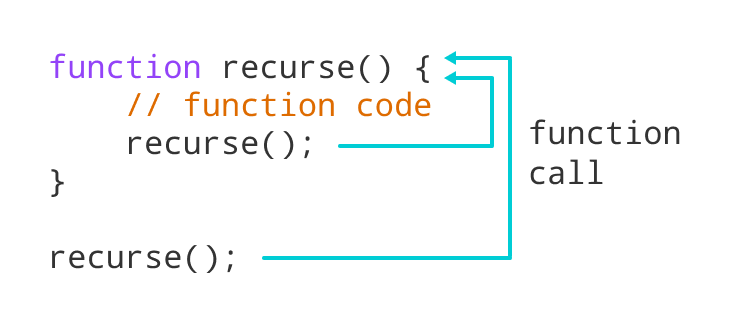

---
tags:
  - algorithms
  - data-structures
  - recursion
---

> A recursive function is a function that calls itself in its definition.

More generally recursion means when a thing is defined in terms of itself. There
are visual analogues that help to represent the idea such as the Droste effect
where an image contains a version of itself within itself. The ouroboros is
another example. Also fractals display recursive properties.

## Schema

The general structure of a recursive function is as follows:


## Why use recursive functions?

Recursion is made for solving problems that can be broken down into smaller,
repetitive problems. It is especially good for working on things that have many
possible branches but are too complex for an iterative approach or too costly in
terms of memory and time complexity.

Recursive programming differs from **iterative** programming but both have
similar use cases. Looping is a canonical example of working iteratively.

## Base condition

> Once a condition is met, the function stops calling itself. This is called a
> base condition.

Because recursion has the potential for infinity, to use it, we must specify a
point at which it ends. However as we are not using an iterative approach we
cannot rely on `while` or `foreach` to specify the boundaries of its operation.
We call this the **base condition** and this will typically be specified using
conditional logic.

The schema for a recursive function with a base condition is:

```jsx
function recurse() {
  if (condition) {
    recurse();
  } else {
    // stop calling recurse()
  }
}

recurse();
```

## Demonstrations

### Countdown

```jsx
// program to count down numbers to 1
function countDown(number) {
  // display the number
  console.log(number);

  // decrease the number value
  let newNumber = number - 1;

  // base case
  if (newNumber > 0) {
    countDown(newNumber);
  }
}

countDown(4);
```

- This code takes `4` as it's input and then outputs a countdown returning:
  `4, 3, 2, 1`
- In each iteration, the number value is decreased by 1
- The base condition is `newNumber > 0` . This breaks the recursive loop once
  the output reaches `1` and stops it continuing into negative integers.

Each stage in the process is noted below:

```
countDown(4) prints 4 and calls countDown(3)
countDown(3) prints 3 and calls countDown(2)
countDown(2) prints 2 and calls countDown(1)
countDown(1) prints 1 and calls countDown(0)
```

### Finding factorials

> The factorial of a positive integer **n** is the product of all the positive
> integers less than or equal to **n**.

To arrive at the factorial of **n** you subtract 1 from **n** and multiply the
result of the subtraction by **n**. You repeat until the subtractive process
runs out of positive integers. For example, if 4 is **n,** the factorial of
**n** is **24:**

$$ 4 _ 3 _ 2 \*1 $$

4 multiplied by 3 gives you 12, 12 multiplied by 2 gives you 24. 24 multiplied
by 1 is 24.

This is clearly a process that could be implemented with a recursive function:

```js
// program to find the factorial of a number
function factorial(x) {
  // if number is 0
  if (x === 0) {
    return 1;
  }

  // if number is positive
  else {
    return x * factorial(x - 1);
  }
}

let num = 3;

// calling factorial() if num is non-negative
if (num > 0) {
  let result = factorial(num);
  console.log(`The factorial of ${num} is ${result}`);
}
```


