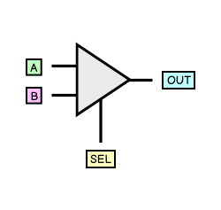

# Multiplexers (MUX) and demultiplexers (DMUX)

## Multiplexer

> Multiplexing is the generic term used to describe the operation of sending one
> or more analogue or digital signals over a common transmission line at
> different times or speeds.

A multiplexer selects one of several input signals and forwards ths selected
input to a single output line.

We have two inputs (A,B) plus a third input SEL (for "select"). Applying a value
to SEL toggles the output between A and B.

Multiplexers can be used to build larger circuits by connecting the output of
one multiplexer to the input of another. They are often used to implement data
selection and switching in digital systems

### Programable gates

One of the main use cases of multiplexers is to implement programmable gates.
These are gates where the logic can be switched. For example an ANDMUXOR gate
uses the SEL value to toggle the operation of a gate between AND and OR for its
two inputs A and B

## Demultiplexer

As the name suggests, a demultiplexer reverses the functionality of a
multiplexer. It receives a single input and based on the selection of the SEL
input it channels it to either an A or a B output.

We can think of it as a distributor of a value into one of several possible
channels.
