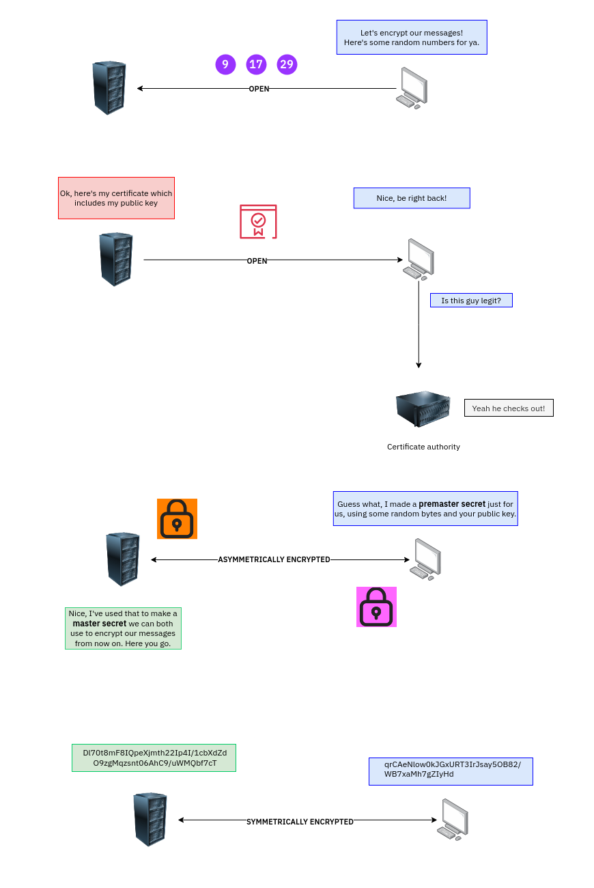

# HTTPS

The problem with standard, unencrypted HTTP requests is that the data can be
captured in transit and be observed or modified by malicious actors.

HTTPS is the solution. It encrypts the entirety of the HTTP request and response
(URL, headers, body).

It utilises two types of encryption to send messages securely:

- symmetric encryption
  - a single shared key between client and server to encrypt the messages sent
    between them
- asymmetric encryption
  - two keys are used: a [public key](./bbdcb54f_public_key_cryptography.md) to
    encrypt the data and a private key to decrypt it. The public key can be
    shared freely so anyone can encrypt and send data to a peer but only the
    peer can receive and decrypt it

> Symmetric encryption applies once the server has been authenticated and its
> public key has been shared with the client. Asymmetric encryption applies at
> the initiation phase only.

The encryption protocol used is TLS - the **Transport Layer Security Protocol**.
Previously SSL (Secure Sockets Layer) was used but has been deprecated over
security concerns.

The initial handshake process takes place entirely within the Network Layer,
over TCP. Only once encryption is secured is HTTPS activated at the
[Application Layer](./Application_Layer_of_Internet_Protocol.md)

## How communication over HTTPs works

- An initial handshake is shared between client and server, agreeing that
  communication will be encrypted. This is public. "Client hello" and "Server
  hello". Some random numbers are exchanged at this point
- The server sends a digital [certificate](./Certificate_authorities.md) key The
  client checks that the certificate is valid
- If valid, the client encrypts a string of bytes using the public key and sends
  it to the server. This is called the "premaster secret"
- This is decrypted by the server
- The premaster secret, along with the random bytes from the handshake is then
  used to compute a shared secret key (symmetric) which is used to encrypt all
  subsequent messages for the duration of the session

## Caching

Once symmetric exchange is achieved the TLS handshake is complete and lasts
typically until either terminates it.

However, some caching does occur on both the server and browser side. Both use
session IDs to enact an abbreviated handshake such as when the session cache
expires. This way, certificate validation and the asymmetric exchange can be
skipped. These tickets are shared as part of the original exchange and the
client can present them to the server as proof they already authenticated when
they come back later.
