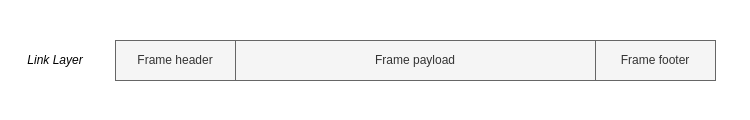

# Link Layer of the Internet Protocol Suite

> The Link Layer is the lowest level of the network stack that makes up the
> Internet Protocol Suite. It is concerned with the physical and logical
> connections between [hosts](./Network_hosts.md) on the same local network.

The physical and logical connections are known as **Links**.

Link Layer protocols goven communication between devices. Examples include:

- **WiFi**
  - For wireless communication between devices using radio waves
- **Ethernet**
  - Wired communication

All devices connected to the internet participate in the Link Layer since it is
the base level and the gateway out of the local network to other networks. The
same is not true for other layers. For example a device like a laptop
participates in all four layers up to the Application Layer but a network router
does not:

## MAC addresses

Each device on a link has a network address that uniquely identifies it. For
most Link Layer Protocols this is a
[Media Access Control (MAC) address](MAC_addresses.md).

A device receives data addressed to its MAC address.

MAC addresses are limited to local networks. Remote networks cannot send data to
a specific MAC address. This is off-limits from the outside.

## Frames

Link Layer data is divided into small units called "frames". The anatomy of a
frame is as follows:

The header contains the source and destination MAC address plus a descriptor of
the type of data it contains. The data is the payload. The footer is used to
detect errors.
