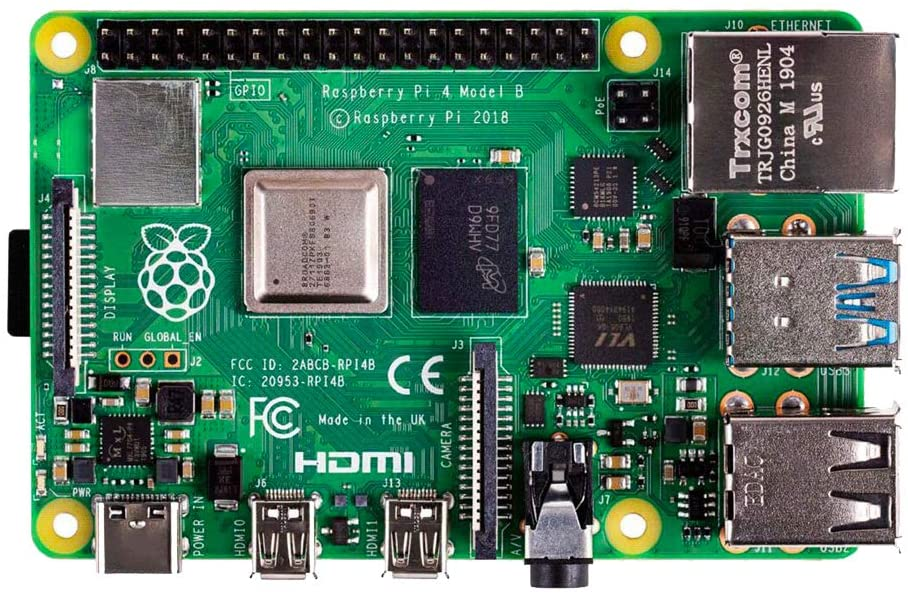

---
tags:
  - hardware
  - computer-architecture
---

# Motherboard

The motherboard is the foundation of a computer. It allocates power and allows
communication to and between the
[CPU](CPU_architecture.md),
[RAM](Memory.md),
[harddisk](What_are_disks.md) and all other hardware
components.

It is a printed circuit board and is always the largest board within the
computer chassis.
