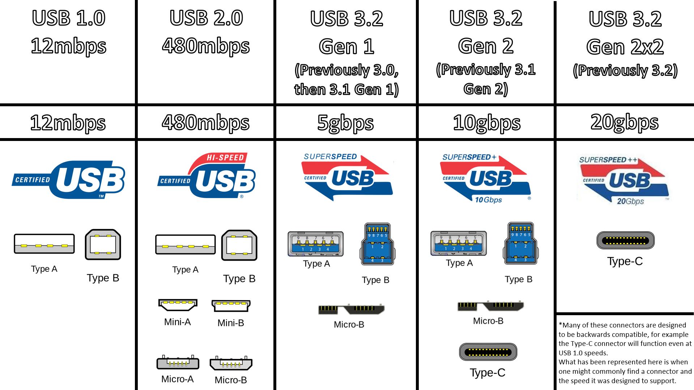

# USB protocols and connectors

Different USB connectors can transfer according to different protocols. A
connector is not always tied to a specific protocol. For instance each
subsequent generation of connector is typically backwards-compatible with the
protocol of the connector that it superseded.

Some connectors are limited to slower protocols but they have the example of
being small which is a benefit for smaller devices. The USB-C connector is so
good because it is both small and capable of supporting the most advanced
protocols (USB-4 and Thunderbolt).

The main types of USB connector:

- USB-A/USB-B
- USB-A/USB-B
- Micro-USB ()
- Mini-USB
- USB-C

The illustration below matches connector to the protocol supported:

