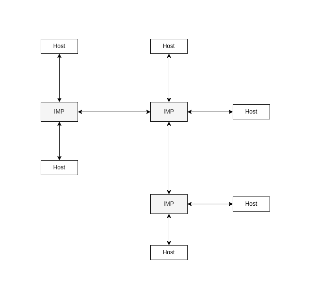

# e470bf3d_IMPs_in_the_ARPANET

Within the #ARPANET, IMPs (Information Message Processors) were nodes
distinguished from [hosts](Network_hosts.md). They were computers designed to
receive and route the the packets from one host to another, described as
"adaptive routing".

Their job was to:

- packetize or reassemble the data from the host
- find the most efficient pathway from one host to another
- store packets in their buffers whilst attending to other requests
- retry the transmission a set number of times in the case of error or data
  corruption
- confirm successful transmission

These responsibilities required the IMP to "know" the location and addresses of
other IMPs and hosts on the [network](Network_fundamentals.md) and their
proximity to them.

From the point of view of the host user, the existence of the IMPs would be
hidden. Hosts would connect to eachother transparently - it would appear as if
you were directly connecting to the other host rather than an IMP.

Thus an IMP was a subnetwork within the broader ARPANET: the IMP would be the
core of this subnetwork and the links to its direct hosts, the periperhy.
Initially, in its full extent, the ARPANET comprised a network of these
subnetworks.

IMPs were later known as 'gateways' and were the precursors to what we today
call routers.
